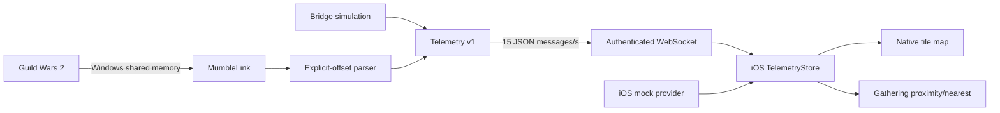
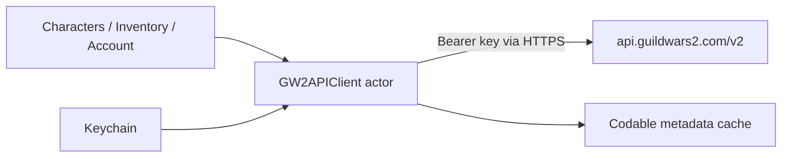

# Architecture

## Live telemetry path

`ITelemetrySource` separates real MumbleLink from deterministic bridge simulation. `LiveTelemetryProvider` does the same for the iOS WebSocket and in-app mock source. Both paths produce the same version-1 envelope.

The bridge reads the shared mapping at the transmit cadence (~15 Hz). MumbleLink itself updates more frequently; sending every source tick would add LAN and rendering work with little perceptual gain. The iOS marker animates between received positions without rebuilding the entire map.

## Account path

The API actor owns request serialization, item batching, and in-memory caches backed by atomic Codable files. The key is read from Keychain only when constructing an authenticated request. It is not stored in `UserDefaults`, exposed to the map, logged, or included in telemetry.

## Replaceable boundaries

- `MapTileProvider`: `ArenaNetTileProvider` now; alternative/offline providers later.
- `MarkerDataProvider`: bundled original sample now; licensed TacO/Blish or remote providers later.
- `LiveTelemetryProvider`: authenticated bridge and mock implementations.
- `GW2APIClient`: isolated service suitable for a fake implementation in previews/integration tests.

The map renderer is native SwiftUI. It requests only visible tiles, renders missing requests as a neutral grid, retains overlay coordinates independently from artwork, and supports north-up pan/zoom/follow modes.

## Trust boundaries

The phone contacts only the paired LAN bridge, official ArenaNet API, and configured tile provider. The bridge exposes selected MumbleLink identity, map, position, camera direction, mount, and UI flags. It has no ArenaNet account credential and no cloud dependency.
